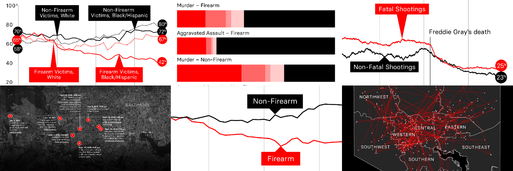

# Unsolved Shootings — Data, Code, and Methodologies

To gain a deeper understanding of America's unsolved-shootings crisis, [The Trace](https://www.thetrace.org/) and [BuzzFeed News](https://www.buzzfeednews.com/) analyzed data from three historical FBI datasets, along with internal data obtained from 22 police departments. We also conducted a detailed analysis of Baltimore shooting victim and suspects. You can read about our main findings here:

- "Shoot Someone In A Major US City, And Odds Are You’ll Get Away With It" (January 24, 2019) — [The Trace](https://www.thetrace.org/features/murder-solve-rate-gun-violence-baltimore-shootings) / [BuzzFeed News](https://www.buzzfeednews.com/article/sarahryley/police-unsolved-shootings)
- "5 Things To Know About Cities’ Failure To Arrest Shooters" (January 24, 2019) — [The Trace](https://www.thetrace.org/2019/01/gun-murder-solve-rate-understaffed-police-data-analysis) / [BuzzFeed News](https://www.buzzfeednews.com/article/sarahryley/5-things-to-know-about-cities-failure-to-arrest-shooters)

We have also published detailed data, code, and methodologies to support those findings:

## Analysis of Police Department Data

*We standardized and analyzed internal data from 22 municipal police departments to examine present-day trends in arrest rates.*

- [Methodology](https://www.documentcloud.org/documents/5692688-Methodology-for-Local-Police-Data.html)
- [Data and code](https://github.com/the-trace-and-buzzfeed-news/local-police-data-analysis)

## Analysis of Baltimore Shooting Data

*We analyzed victim and suspect data on nearly 3,500 fatal and non-fatal shootings in Baltimore.*

- [Methodology, data, and code](https://github.com/the-trace-and-buzzfeed-news/baltimore-shootings-analysis)

## Analysis of FBI Data

*We analyzed three major FBI datasets — the Supplementary Homicide Report, the National Incident-Based Reporting System, and Return A — to examine historical trends in unsolved shootings.*

- [Methodology](https://www.documentcloud.org/documents/5692683-Methodology-for-National-Analysis-of-Clearance.html)
- [Data and code](https://github.com/the-trace-and-buzzfeed-news/federal-crime-data-analysis)

# Questions?

For questions or feedback, please contact Jeremy Singer-Vine ([jeremy.singer-vine@buzzfeed.com](jeremy.singer-vine@buzzfeed.com)) and Sarah Ryley ([sryley@thetrace.org](sryley@thetrace.org)).
